# 🔮 Churn Prediction Dashboard

An interactive **Flask web application** for customer churn prediction, data exploration, and visualization with **Tableau dashboards**.

---

## 🚀 Features
- ✅ Predict customer churn using trained ML models  
- ✅ Explore dataset with interactive filtering  
- ✅ Visualize churn patterns using Tableau dashboards  
- ✅ View model performance (ROC curves, confusion matrices)  
- ✅ Built with Flask, Python, scikit-learn, and Bootstrap  

---

## 📂 Project Structure

## ⚙️ Installation
```bash
git clone https://github.com/<your-username>/churn-prediction-dashboard.git
cd churn-prediction-dashboard
pip install -r requirements.txt
python app.py
```

📸 Screenshots
🖥️ Web App Previews (Flash Dashboard)
| Preview 1                               | Preview 2                               | Preview 3                               |
| --------------------------------------- | --------------------------------------- | --------------------------------------- |
| 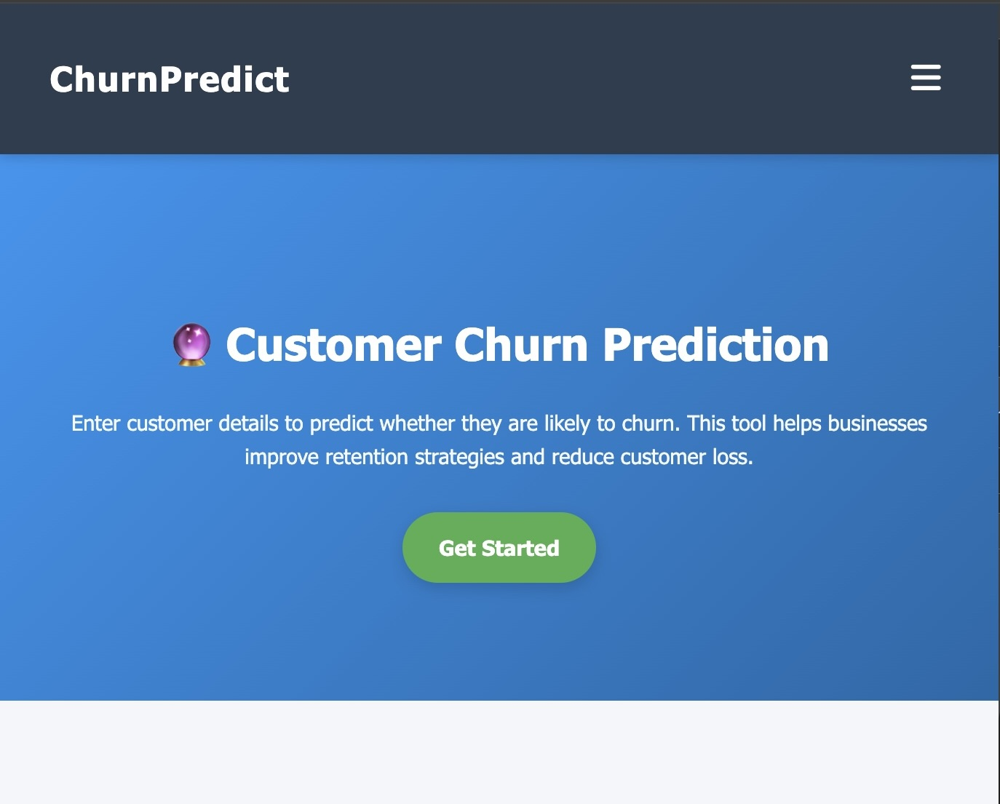  | 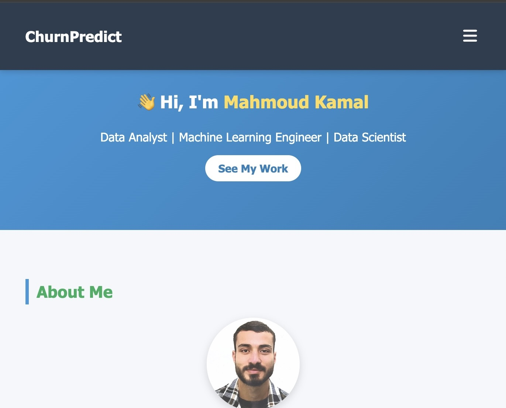  | 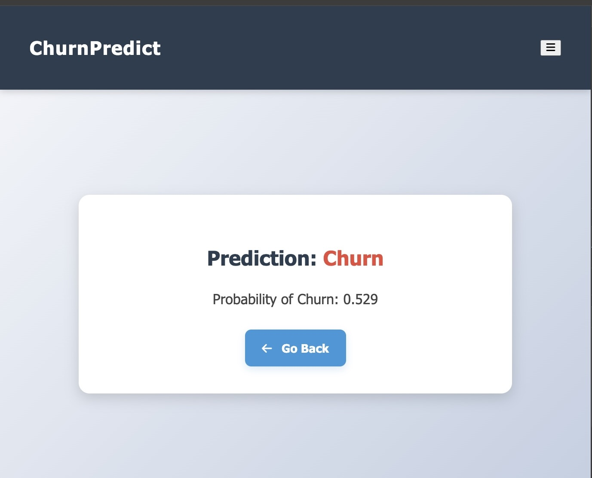  |
| 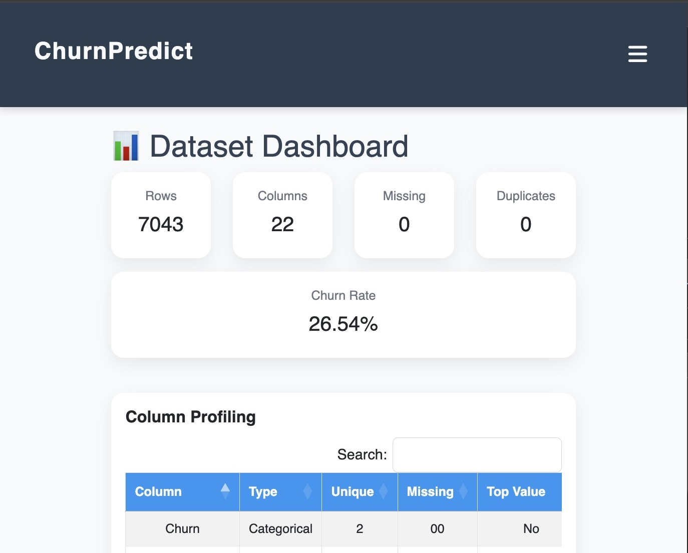  | 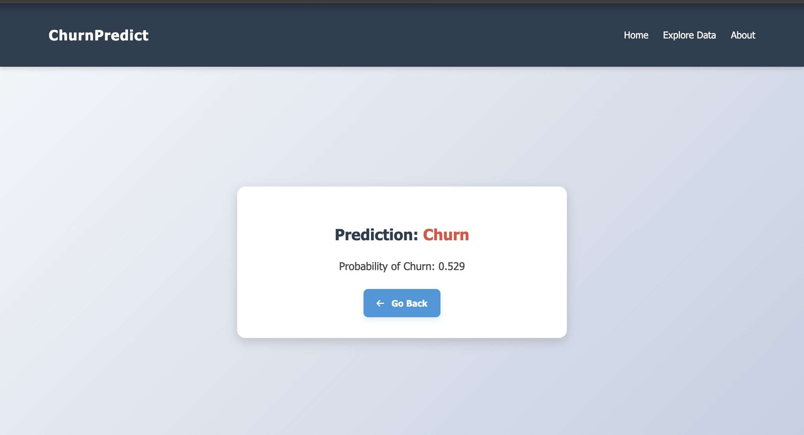  | 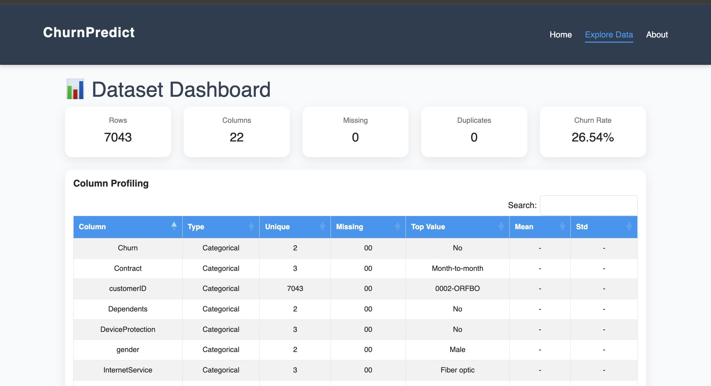  |
| 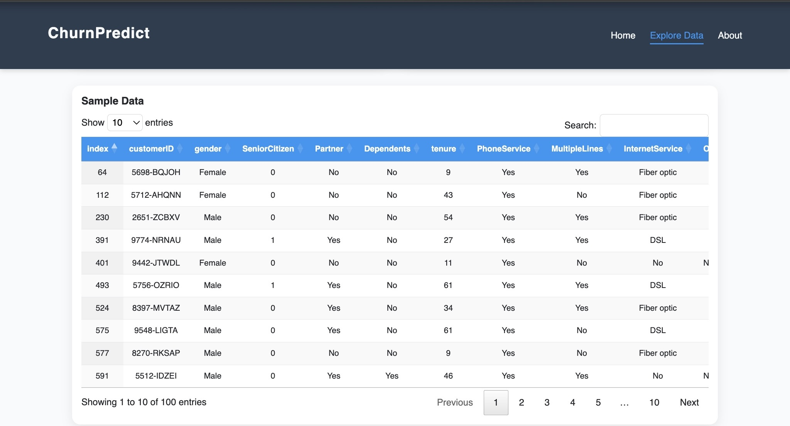  | 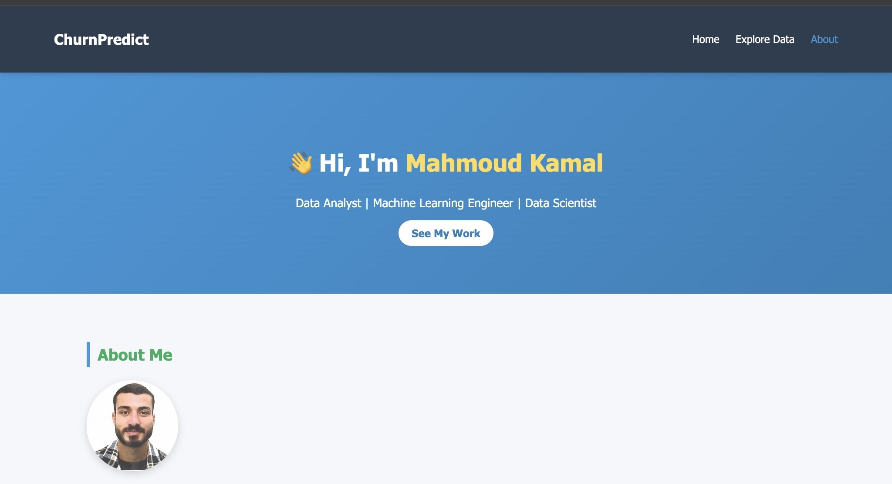  | 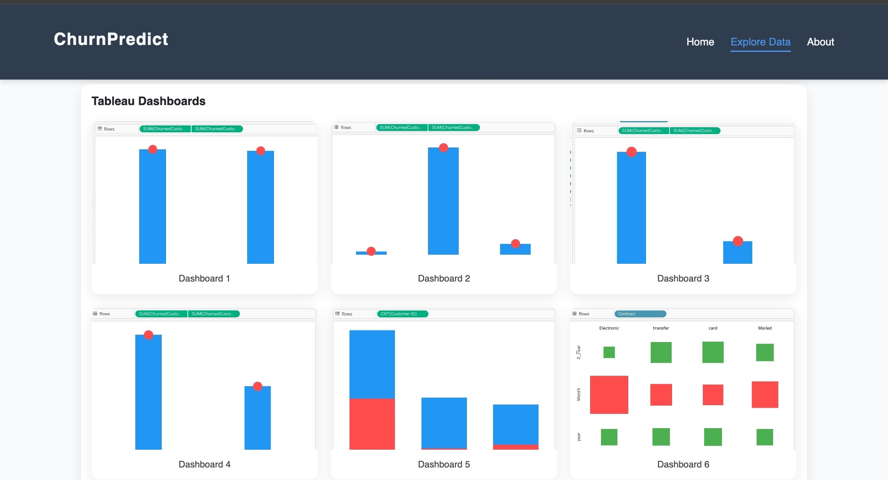  |
| 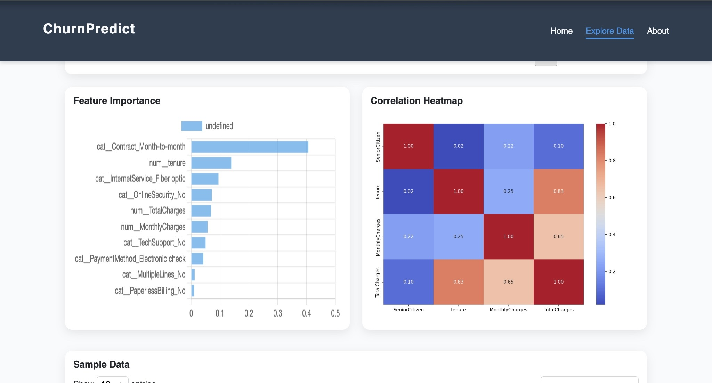 | 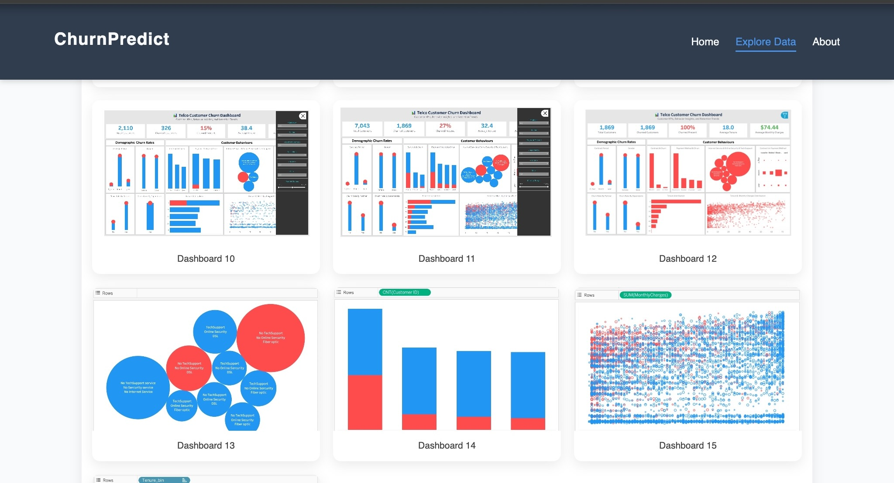 |  |
| 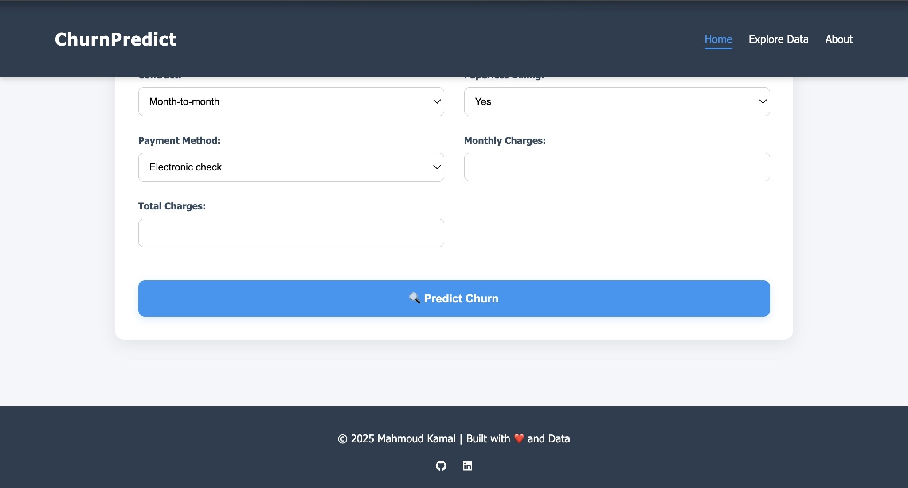 | 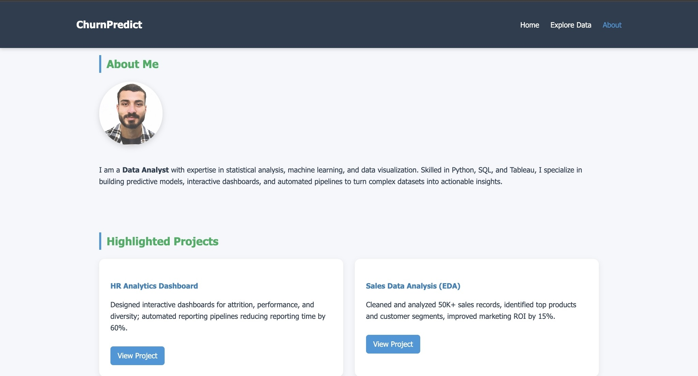 |  |
| 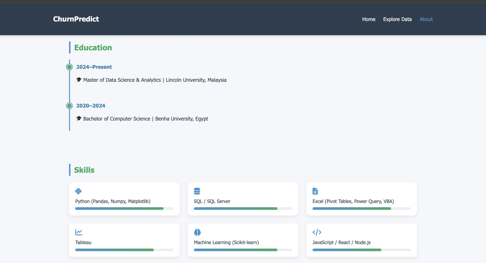 |                                         |                                         |
📊 Tableau Insights

| Churn by Gender                                          | Churn by Contract                                          | Churn by Partner                                          |
| -------------------------------------------------------- | ---------------------------------------------------------- | --------------------------------------------------------- |
|  | 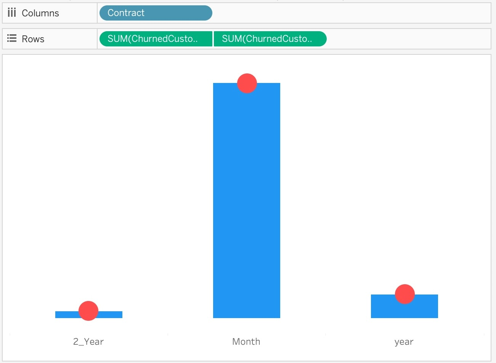 | 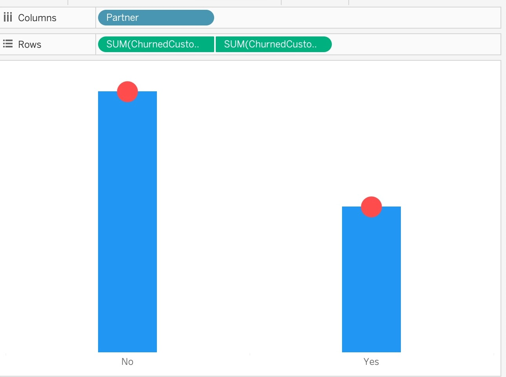 |

🤖 ML Models

Logistic Regression
Random Forest (Tuned)
Gradient Boosting

## 👨‍💻 Author
**Mahmoud Kamal**  

-  [GitHub](https://github.com/OverStarData)  
-  [LinkedIn](https://www.linkedin.com/in/mahmoud-kamal-14208136b/)  
