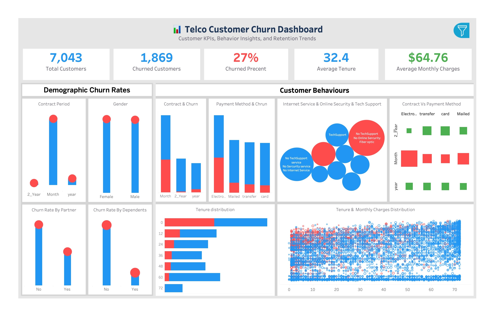

# 🔮 Churn Prediction Dashboard

An interactive **Flask web application** for customer churn prediction, data exploration, and visualization with **Tableau dashboards**.

## 🚀 Features
- Predict customer churn using trained ML models
- Explore dataset with interactive filtering
- Visualize churn patterns using Tableau dashboards
- View model performance (ROC curves, confusion matrices)
- Built with Flask, Python, scikit-learn, and Bootstrap

## 📂 Project Structure
app.py # Flask app
requirements.txt # Python dependencies
templates/ # HTML templates
static/ # CSS, JS, and images
notebooks/ # Data cleaning & model training
screenshots/ # App & dashboard previews

## ⚙️ Installation
bash
git clone https://github.com/<your-username>/churn-prediction-dashboard.git
cd churn-prediction-dashboard
pip install -r requirements.txt
python app.py
📸 Screenshots
| Dashboard Preview                      | Tableau Insights                                        
  |  |
📊 ML Models

Logistic Regression

Random Forest (Tuned)

Gradient Boosting
