# 🔮 Churn Prediction Dashboard

An interactive **Flask web application** for customer churn prediction, data exploration, and visualization with **Tableau dashboards**.

---

## 🚀 Features
- ✅ Predict customer churn using trained ML models  
- ✅ Explore dataset with interactive filtering  
- ✅ Visualize churn patterns using Tableau dashboards  
- ✅ View model performance (ROC curves, confusion matrices)  
- ✅ Built with Flask, Python, scikit-learn, and Bootstrap  

---

## 📂 Project Structure
- `app.py` → Flask application  
- `requirements.txt` → Python dependencies  
- `templates/` → HTML templates  
- `static/` → CSS, JS, and images  
- `notebooks/` → Jupyter notebooks (EDA, preprocessing, model training)  
- `screenshots/` → App & dashboard previews  

---

## ⚙️ Installation
```bash
git clone https://github.com/OverStarData/customer-churn-analytics.git
cd churn-prediction-dashboard
pip install -r requirements.txt
python app.py
```

Screenshots
🖥️ Web App Previews (Flash Dashboard)
| Preview 1                               | Preview 2                               | Preview 3                               |
| --------------------------------------- | --------------------------------------- | --------------------------------------- |
|   |   |   |
|   |   |   |
|   |   |   |
|  |  |  |
|  |  |  |
|  |                                         |                                         |
📊 Tableau Insights
| Gender vs Churn                                          | Contract vs Churn                                          | Dependents vs Churn                                          |
| -------------------------------------------------------- | ---------------------------------------------------------- | ------------------------------------------------------------ |
|  |  | 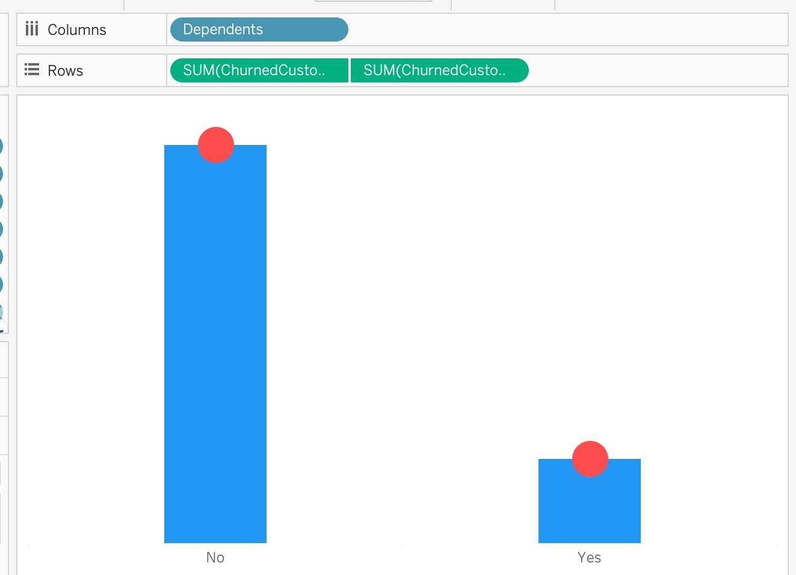 |
| Partner vs Churn                                          | Contract vs Payment Method                                       | Internet Service vs Churn                                         |
| --------------------------------------------------------- | ---------------------------------------------------------------- | ----------------------------------------------------------------- |
|  | 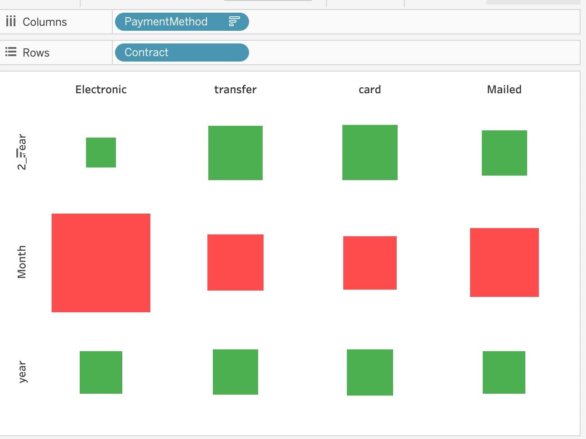 | 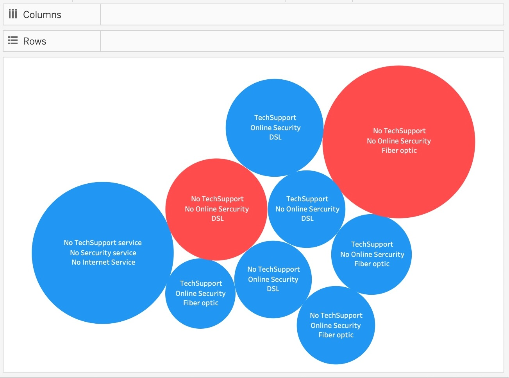 |
| Payment Method vs Churn                                        | Tenure Distribution                                        | Tenure & Charges Distribution                                                  |
| -------------------------------------------------------------- | ---------------------------------------------------------- | ------------------------------------------------------------------------------ |
| 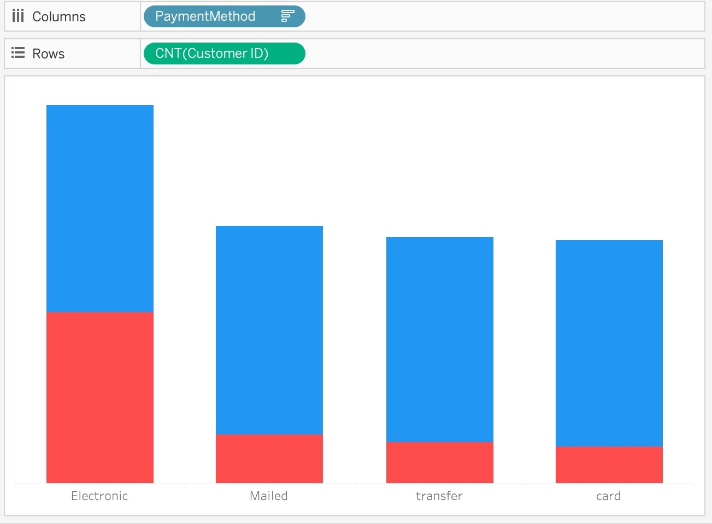 | 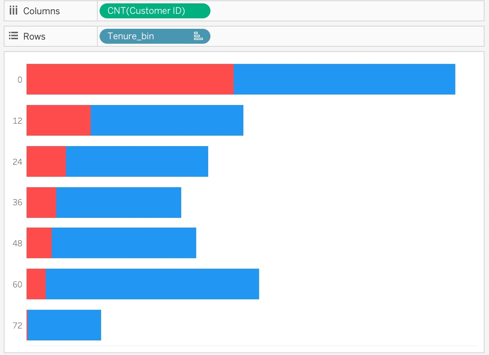 | 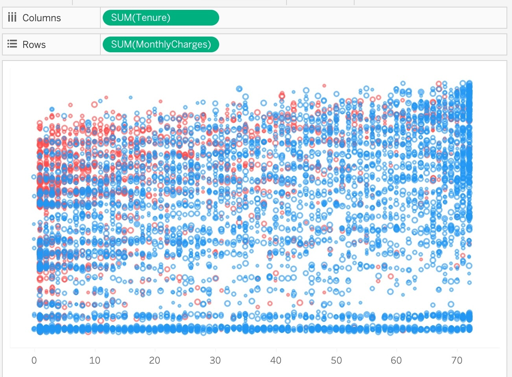 |
| Customer Churn 01                                        | Customer Churn 02                                        | Customer Churn 03                                        |
| -------------------------------------------------------- | -------------------------------------------------------- | -------------------------------------------------------- |
|  | 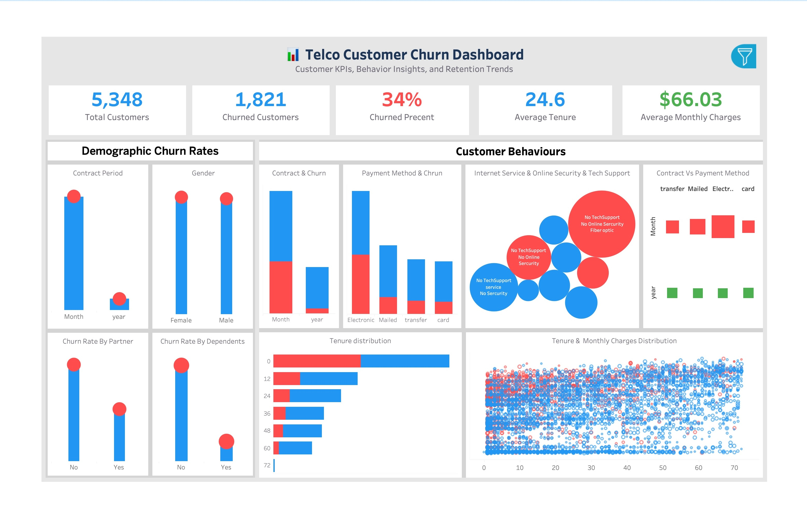 | 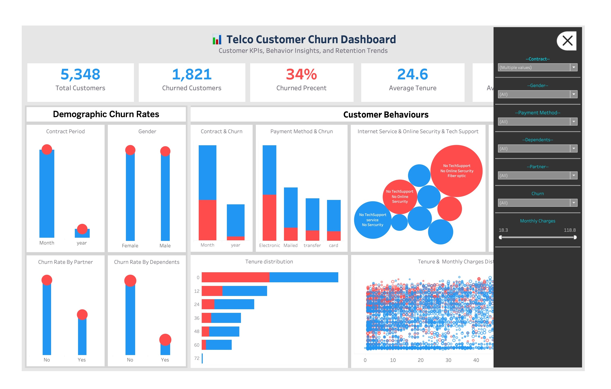 |
| Customer Churn 04                                        | Customer Churn 05                                        | Customer Churn 06                                        |
| -------------------------------------------------------- | -------------------------------------------------------- | -------------------------------------------------------- |
| 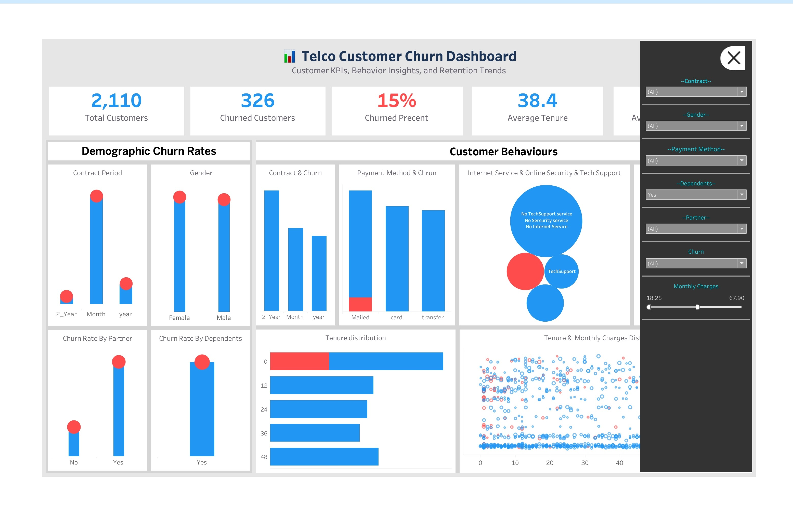 | 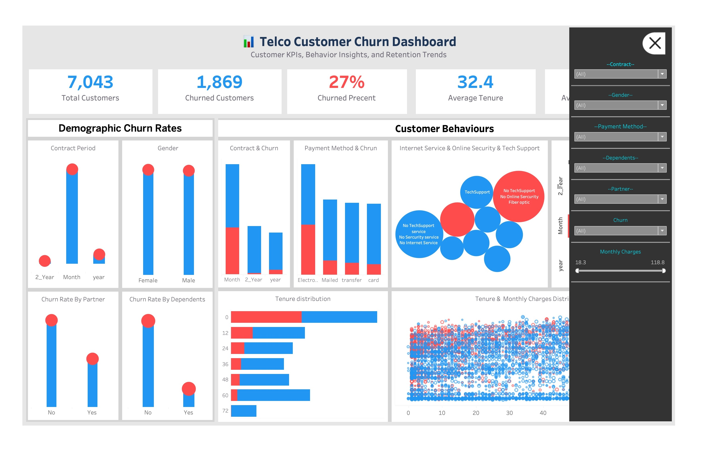 | 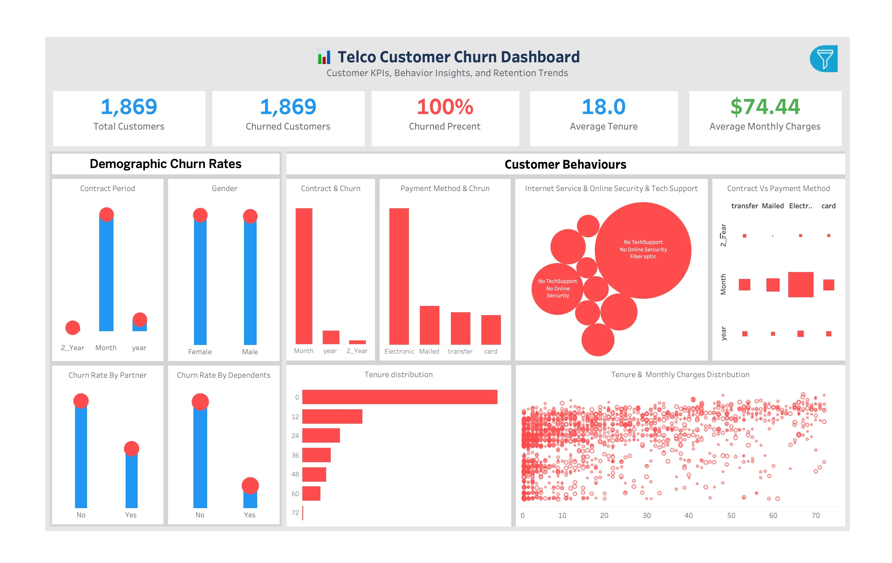 |

🤖 ML Models
-------------


Logistic Regression

Random Forest (Tuned)

Gradient Boosting

👨‍💻 Author

Mahmoud Kamal

GitHub

LinkedIn
=======


## 👨‍💻 Author
**[Mahmoud Kamal](https://github.com/OverStarData)**  
 [GitHub](https://github.com/OverStarData) |  [LinkedIn](https://www.linkedin.com/in/mahmoud-kamal-14208136b/)
>>>>>>> 164b9f991110a914acc029a0615f2fd8a5f5a095
